# MealMate 🍳

> MealMate, Kotlin ve Jetpack Compose ile geliştirilmiş, modern bir yemek tarifi ve mutfak yönetimi uygulamasıdır. Kullanıcı dostu arayüzü ve zengin özellikleriyle mutfağınızı daha iyi yönetmenize yardımcı olur.


## Proje Açıklaması
MealMate, yemek tarifleri ve yemek planlama konusunda kullanıcılara yardımcı olan kapsamlı bir Android uygulamasıdır. Uygulama, kullanıcıların tarifleri keşfetmesine, alışveriş listesi oluşturmasına ve yemeklerini planlamasına olanak tanır.

## Özellikler 🌟
- **Detaylı Tarifler**: Adım adım resimli yemek tarifleri
- **Malzeme Yönetimi**: Dolap içeriğinizi takip edin
- **Alışveriş Listesi**: Market alışverişlerinizi planlayın
- **Yemek Planı**: Haftalık yemek planınızı oluşturun
- **Besin Değerleri**: Her tarif için detaylı besin değeri bilgileri
- **Favori Tarifler**: Sevdiğiniz tarifleri kaydedin
- **Arama ve Filtreleme**: Tarifleri kolayca bulun

## Teknolojiler 💻
- Kotlin
- Jetpack Compose
- Material Design 3
- Android Architecture Components
- MVVM Mimarisi

## Ekran Görüntüleri 📱

| | | | | |
| :---: | :---: | :---: | :---: | :---: |
| 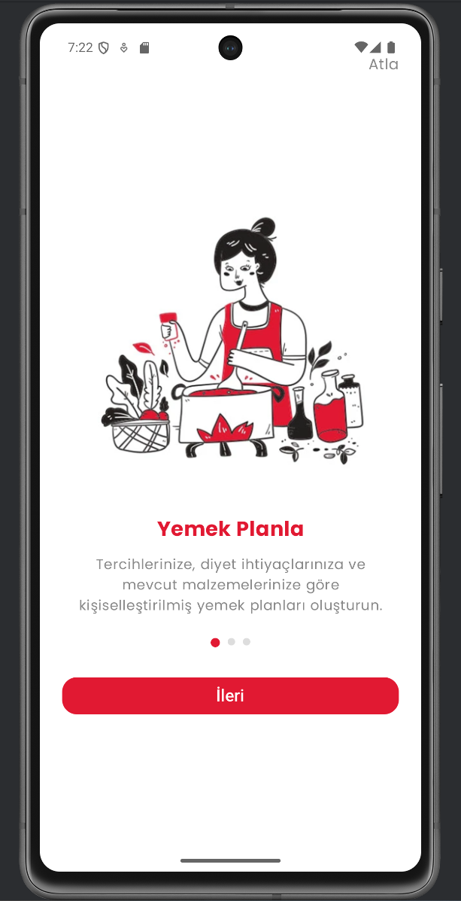 | 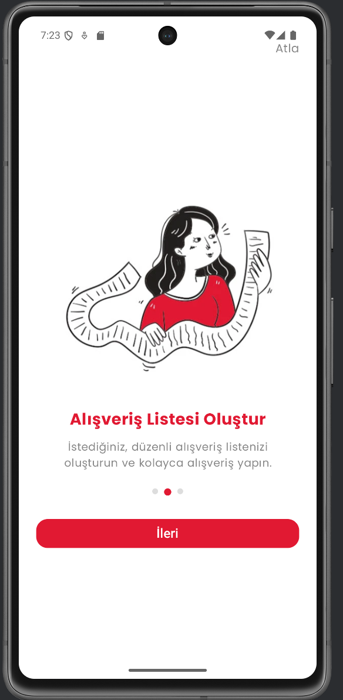 | 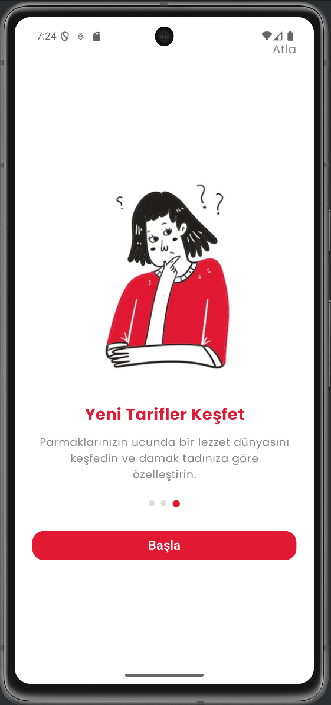 | 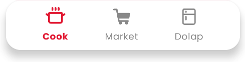 | 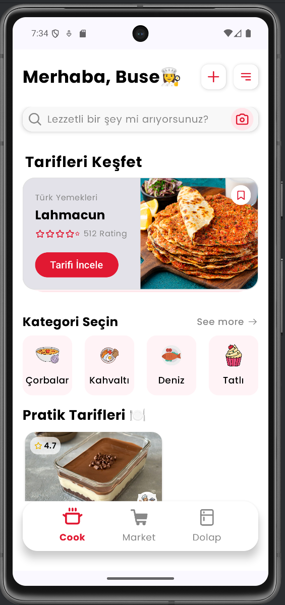 |
|  |  | 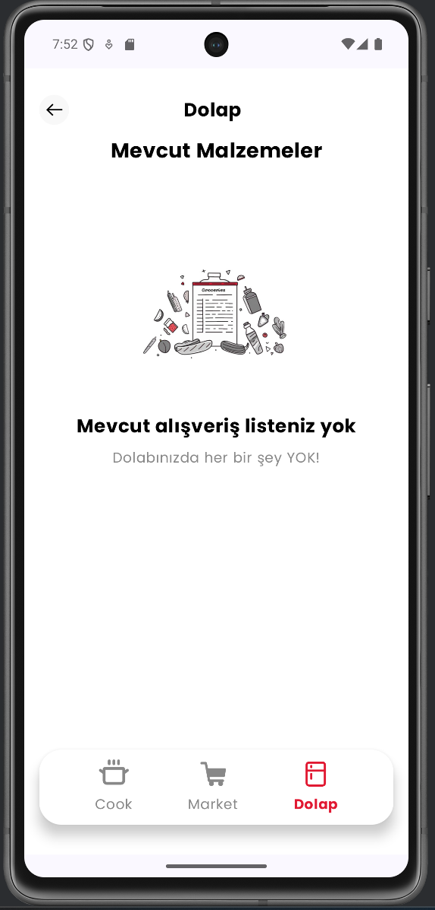 | 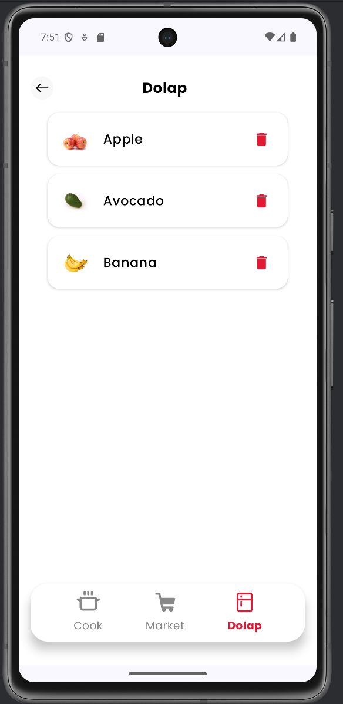 | 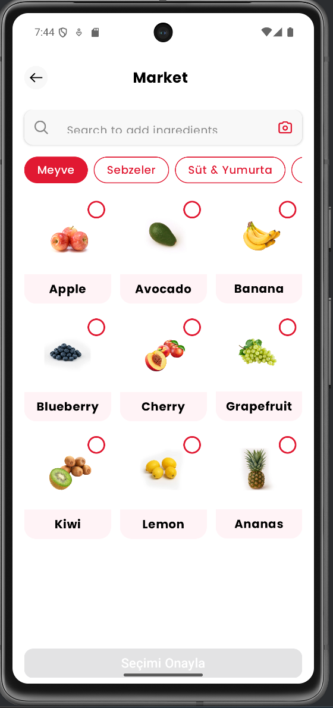 |
| 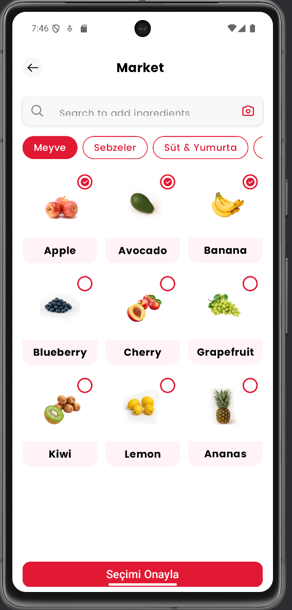 | 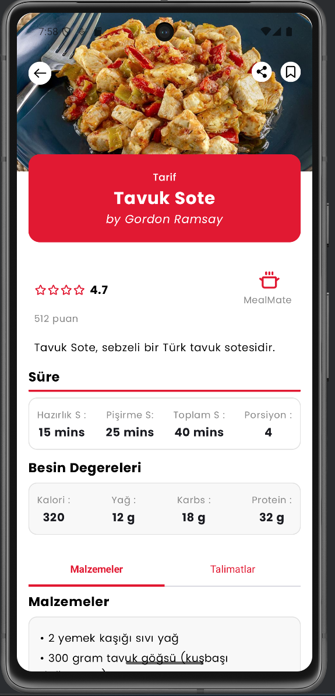 | 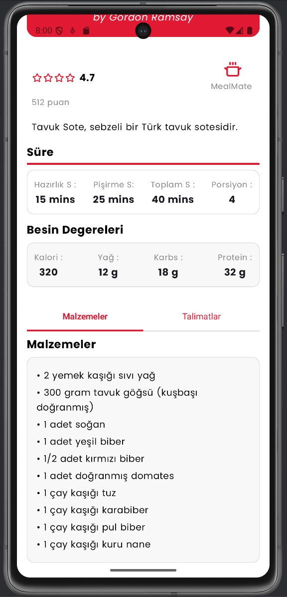 | 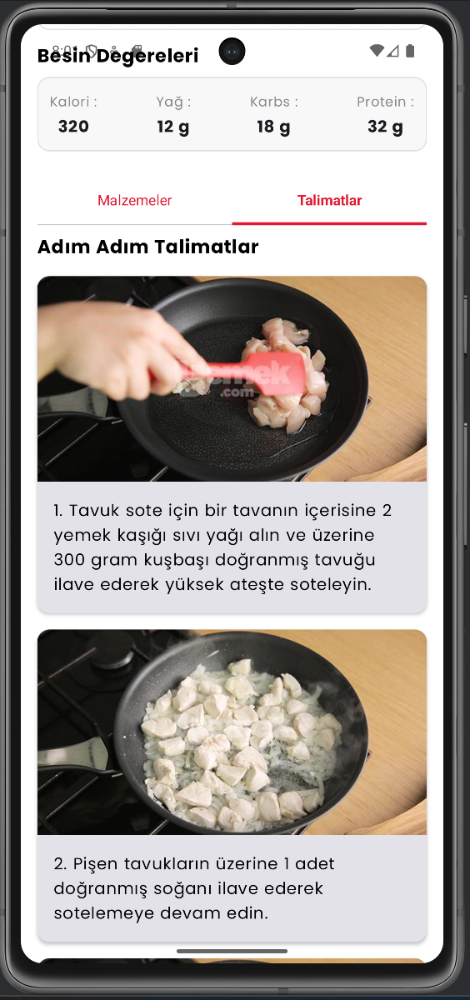 | |

## Kurulum 🔧
1. Projeyi klonlayın:
```bash
git clone https://github.com/BuseYksll/MealMate-Android-app.git
```
2. Android Studio'da projeyi açın
3. Gradle senkronizasyonunu tamamlayın
4. Uygulamayı çalıştırın

## Katkıda Bulunma 🤝
1. Bu repository'yi fork edin
2. Yeni bir branch oluşturun (`git checkout -b feature/YeniOzellik`)
3. Değişikliklerinizi commit edin (`git commit -m 'Yeni özellik eklendi'`)
4. Branch'inizi push edin (`git push origin feature/YeniOzellik`)
5. Pull Request oluşturun

## Lisans 📄
Bu proje MIT lisansı altında lisanslanmıştır. Daha fazla bilgi için `LICENSE` dosyasına bakın.

## İletişim 📧
- Proje sahibi: [BuseYksll](https://github.com/BuseYksll)
- Proje linki: [https://github.com/BuseYksll/MealMate-Android-app](https://github.com/BuseYksll/MealMate-Android-app)